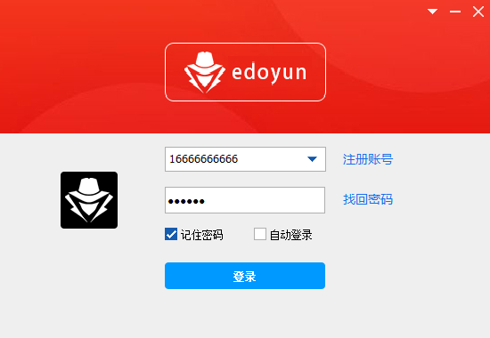
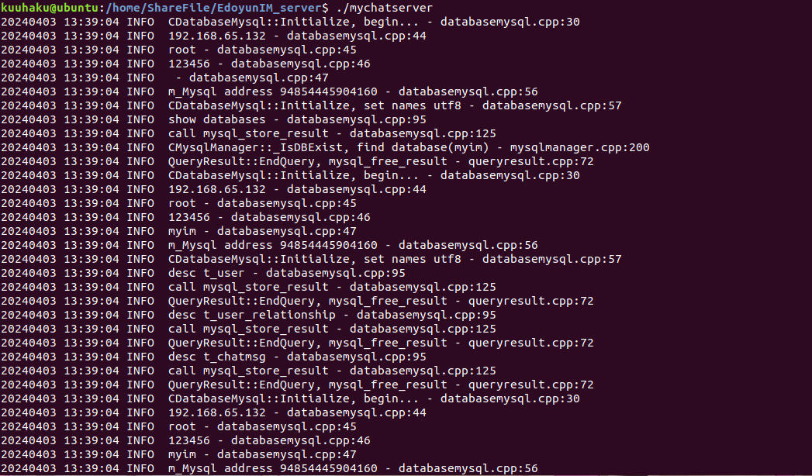
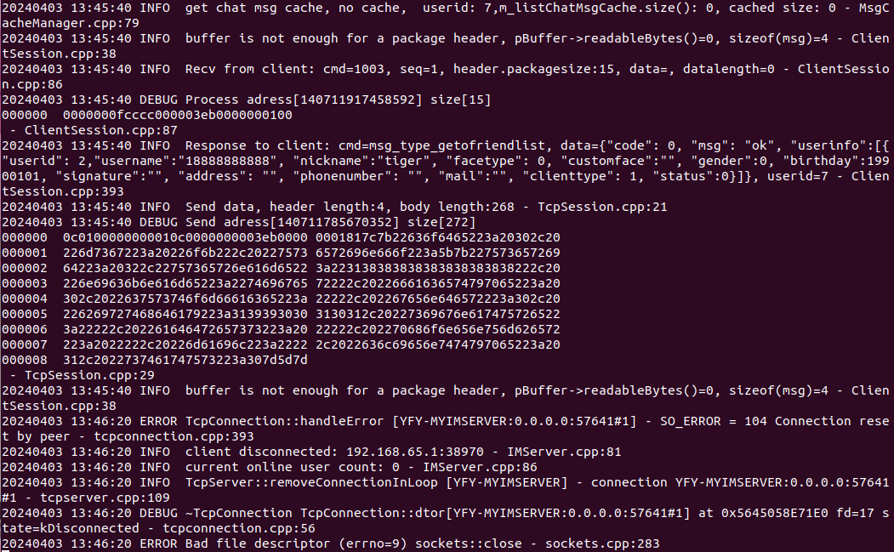

# IMProject
## 项目简介

本项目是基于WTL实现的仿QQ网络聊天软件，通过Linux下的服务器进行登录验证和数据的收发，并使用MySQL对聊天信息进行存储,实现了包括登录注册、好友查找、创建群组、加入群组、聊天信息离线缓存等多项功能。

## 主要技术

语言和平台：`C++`、`Windows`(客户端)、`Linux`(服务端)

客户端：`WTL`、`protobuf`、`ThreadPool`、`WindowsAPI`

服务端：`CMake`、`muduo`、`Reactor`、`epoll`、`socket`、`MySQL`、`ORM`

## 部署和使用方法

客户端：`visual studio 2019 WTL Win32`

服务端：`Ubuntu 18.04`、`CMake`

## 运行效果

[客户端主页面]

[客户端主页面]

[聊天页面]

[服务器启动]

[客户端登录]

